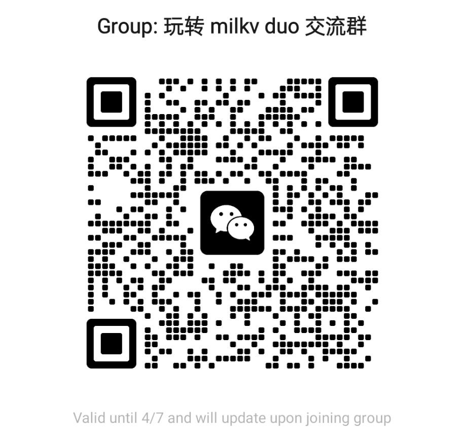

# 玩转 Milk-v Duo

---

## 简介

本仓库为 玩转 Milk-v Duo 课程文件整理仓库。用于存放课程中使用到的 slides ，参考资料和部分代码。  

欢迎加入 玩转 Milk-v Duo 交流群：

大家一起交流学习。如果微信群二维码失效请联系东东进入微信群。

## 备注

1. 在课程 01 RVOS on Duo 中使用的 rvos 的版本 commit 为 [c0e6ce1](https://github.com/plctlab/riscv-operating-system-mooc/commit/c0e6ce15f01c6aaf5d5765021c0be8935de0a762)。

2. 在课程 02 RT-Thread on Duo 中使用的 rtt 的版本 commit 为 [ac2f7f0](https://github.com/RT-Thread/rt-thread/tree/ac2f7f05bfa91a2ab4ceded8678a4391d2223953)。

3. 在课程 04 Camera and Yolov5 课程中使用的文档如下：
   1. [TDL SDK软件开发指南](https://doc.sophgo.com/cvitek-develop-docs/master/docs_latest_release/CV180x_CV181x/zh/01.software/TPU/TDL_SDK_Software_Development_Guide/build/html/1_disclaimer.html)
   2. [CV180x/CV181x 媒体软件开发指南](https://doc.sophgo.com/cvitek-develop-docs/master/docs_latest_release/CV180x_CV181x/zh/01.software/MPI/Media_Processing_Software_Development_Reference/build/html/index.html)  
   

更多文档请参阅: https://milkv.io/zh/docs/duo/resources/mmf
   